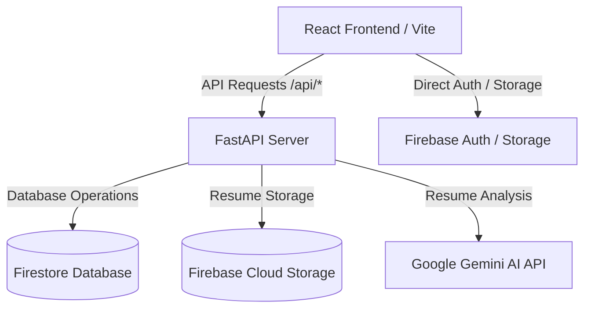

# AURA AI Hiring Agent 🤖💼

AURA is a premium, full-stack AI-powered recruitment and resume screening application. It helps hiring managers automate resume assessment, rank candidates based on customized job requirements, and manage the candidate pipeline from a unified, modern administrative dashboard.

## 🚀 Key Features

- **AI Resume Screening**: Uses **Google Gemini AI** to read uploaded candidate resumes (PDF, Word, or Text), evaluate them against job postings, and provide precise suitability scores and actionable feedback.
- **Unified Admin Dashboard**: Track job postings, review applications, view AI scores and feedback, and manage candidate hiring states (Applied, Shortlisted, Interviewed, Hired, Rejected).
- **Responsive glassmorphism UI**: Built with React, Vite, and Tailwind CSS for an incredibly smooth and responsive user experience.
- **Firebase Backend Integration**: Stores structured applicant data, job listings, and admin profiles in **Firestore**, handles resume document storage in **Firebase Cloud Storage**, and securely manages users via **Firebase Authentication**.
- **Mock Mode**: Fully operational, isolated simulation mode for offline development or testing without invoking external API costs.

---

## 🏗️ Architecture



---

## 🛠️ Configuration & Credentials (Environment Variables)

To connect the application to live cloud services, you will need two main credentials.

### 1. `GEMINI_API_KEY`
* **Purpose**: Used by the backend to call the Gemini model for parsing, evaluating, and scoring resume documents.
* **Link to Obtain**: [**Google AI Studio - Get API Key**](https://aistudio.google.com/)
* **Steps**: Log in with your Google account, click **Get API key**, and select/create a project to generate your token.

### 2. `GOOGLE_APPLICATION_CREDENTIALS_JSON` / `FIREBASE_CREDENTIALS_PATH`
* **Purpose**: Authorizes the backend to securely access your Firestore Database, Firebase Storage, and Firebase Auth.
* **Link to Obtain**: [**Firebase Console**](https://console.firebase.google.com/)
* **Steps**: 
  1. Open your project in the Firebase Console.
  2. Click **Project Settings** (gear icon next to Project Overview) -> **Service accounts**.
  3. Under the **Firebase Admin SDK** section, click **Generate new private key** and download the `.json` file.
  4. **For Local Development**: Save this file in the `backend/` directory as `service-account.json`.
  5. **For Production Deployment**: Copy the entire text content of this JSON file and add it as the value for the `GOOGLE_APPLICATION_CREDENTIALS_JSON` environment variable.

---

## 💻 Local Setup & Installation

### Backend (FastAPI)
1. Navigate to the backend directory:
   ```bash
   cd backend
   ```
2. Create and activate a Python virtual environment:
   ```bash
   python -m venv venv
   # On Windows:
   venv\Scripts\activate
   # On macOS/Linux:
   source venv/bin/activate
   ```
3. Install dependencies:
   ```bash
   pip install -r requirements.txt
   ```
4. Create a `.env` file inside the `backend` folder (you can use `.env.example` as a template):
   ```ini
   PORT=8000
   HOST=0.0.0.0
   MOCK_MODE=false # Set to true to run locally without connecting to live APIs
   GEMINI_API_KEY=your_gemini_api_key_here
   FIREBASE_CREDENTIALS_PATH=service-account.json
   FIREBASE_STORAGE_BUCKET=your-app.firebasestorage.app
   FIREBASE_DATABASE_URL=https://your-app.firebaseio.com
   ```
5. Run the development server:
   ```bash
   uvicorn app.main:app --reload --port 8000
   ```

### Frontend (React + Vite)
1. Navigate to the frontend directory:
   ```bash
   cd frontend
   ```
2. Install npm packages:
   ```bash
   npm install
   ```
3. Create a `.env` file inside the `frontend` folder:
   ```ini
   VITE_API_URL=/api
   VITE_FIREBASE_API_KEY=your_firebase_api_key
   VITE_FIREBASE_AUTH_DOMAIN=your_project.firebaseapp.com
   VITE_FIREBASE_PROJECT_ID=your_project_id
   VITE_FIREBASE_STORAGE_BUCKET=your_project.firebasestorage.app
   VITE_FIREBASE_MESSAGING_SENDER_ID=your_sender_id
   VITE_FIREBASE_APP_ID=your_app_id
   ```
4. Run the frontend development server:
   ```bash
   npm run dev
   ```
   *The client will run on `http://localhost:5173`. Any `/api/*` call will automatically be proxied to the FastAPI server on port `8000` via Vite's development proxy.*

---

## 🚀 Deployment

The project is structured to deploy the Frontend and Backend seamlessly together using **Firebase Hosting** and **Google Cloud Run**:

- **Frontend**: Built via `npm run build` and served from `frontend/dist` via Firebase Hosting.
- **Backend**: Containerized using `backend/Dockerfile` and run in Google Cloud Run.
- **Routing Rewrite**: All `/api/*` requests hitting Firebase Hosting are rewritten to point directly to the backend Cloud Run service, avoiding any Cross-Origin Resource Sharing (CORS) issues in production.

For detailed configuration files, see:
- [firebase.json](file:///c:/Users/chund/Project7/firebase.json)
- [backend/Dockerfile](file:///c:/Users/chund/Project7/backend/Dockerfile)
- [backend/render.yaml](file:///c:/Users/chund/Project7/backend/render.yaml)
